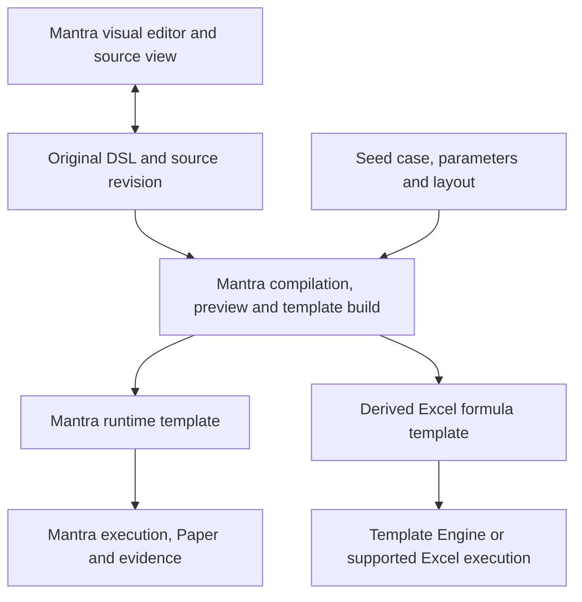

# Mantra DSL authoring and two delivery targets

> Direction decision: **Mantra owns an independent visual DSL editor. Both delivery
> targets consume its common source/build path, then run in Mantra or Excel runtimes.**
> The visual template editor and target publishing integration remain planned.

## Common authoring and build path

Authors edit one original DSL definition through Mantra's own visual editor or source view.
Editing, saving, validating and previewing the DSL form an independent Mantra workflow.
Template Engine consumes the derived Excel template downstream. The common path refers
to one authoring/build workflow feeding both targets, not a cross-project editor product.
The grid updates source-owned schema/layout declarations; labels, formulas, types,
dimensions, reusable patterns and style classes remain in the DSL. Mantra compiles and
validates that definition and drives the author's preview. Selecting a delivery target
does not switch the source language or establish a second writable template.

This is one authoring pipeline with two execution/delivery targets. Repository and module
boundaries can remain separate while the workflow and template source are shared.
Downstream numerical runtimes, edit histories and instance storage remain distinct.

The current implementation already supports `Mantra.compile`, followed by calculation
with a case and effective parameters. Its formula-preserving
[ExcelExport](../mantra-excel/src/main/kotlin/com/xqiou/mantra/excel/ExcelExport.kt)
accepts `CalculationResult` or `CalculationView`, a layout and export options. It does
not currently accept a bare compiled schema and produce a reusable Template Engine
template directly. The shared build needs a declared initial case/shape, parameter set,
layout, input contract and target capabilities. Reuse this existing compilation/export
path; a new public intermediate representation is not required by the product decision.

The reviewed [Template Engine](https://github.com/6234456/paramita-v2) source is
[`6443c688`](https://github.com/6234456/paramita-v2/commit/6443c68875a8592e79ea2099637545fe96a18ec0),
dated 2026-10-10. This is a source assessment, not a new runtime or Microsoft Excel
compatibility verification.

| Boundary | Shared upstream | Mantra target | Excel/Template Engine target |
| --- | --- | --- | --- |
| Template source | Original schema, parameters and layout DSL | Consumes the common source revision | Generated formulas/names/layout reference that same source revision |
| Authoring | One visual/source editor, DSL language assistance and source undo/save | Same upstream authoring | Same upstream authoring |
| Rule semantics | Declared types, dimensions, rounding and findings | Normein/Mantra exact calculation and trace | Compatible formula lowering and declared numerical limits |
| Runtime instance | Source-version and input-contract association | Mantra case, typed inputs and revisions | Office workbook cells, supported formulas and Office history |
| Delivery | Common template identity and build record | Mantra runtime and controlled outputs | Derived Excel template and supported workbook outputs |

Data adapters and multiple displays can serve both targets. The fork concerns execution
and delivery: one target continues to use Mantra, while the other executes derived Excel
formulas in its declared workbook runtime. Target translation may reject unsupported
semantics without invalidating the DSL for Mantra execution. Availability remains governed
by each target's actual implementation and compatibility evidence.

## Existing formula-based examples

The following existing workbook-authored applications demonstrate downstream Office
capabilities; they have not been retroactively generated from the proposed shared DSL
authoring path. Existing workbooks do not require automatic reverse conversion to DSL.

The latest Template Engine source contains a
[German tax workbook factory](https://github.com/6234456/paramita-v2/blob/6443c68875a8592e79ea2099637545fe96a18ec0/apps/manifest-runtime/src/office-v2/applications/german-tax/germanTax2026Factory.ts)
and a
[financial-notes projection](https://github.com/6234456/paramita-v2/blob/6443c68875a8592e79ea2099637545fe96a18ec0/apps/manifest-runtime/src/office-v2/applications/german-notes/germanNotesProjection.ts).
The latter builds `Disclosure`, `Calculation` and `SourceDetail` worksheets and uses
native `SUMIFS`, `RANK`, `COUNTIF`, `INDEX`, `MATCH` and `SUM` for recalculation and sorting.
Source preparation owns frozen membership and classification; workbook formulas operate
on those inputs. Its current source describes a model/artifact builder, not a completed
catalog, creation UI or remote deployment.

The entire Office engine is broader than a pure Excel-formula template: it also supports
template-variable expressions and custom query functions. For an Excel-native template,
business calculation formulas in the delivered workbook must remain native and inputs
must be materialized explicitly. Unsupported syntax and template-specific functions must
not silently become a claimed recalculating Excel result. Export coverage and any static
value substitutions need to remain visible. No VBA or macros are required by the reviewed
formula-based examples; this does not imply full Excel language compatibility.

For example, the tax workbook's web parameter cells use `TEMPLATEVAR`; the existing
[artifact projection](https://github.com/6234456/paramita-v2/blob/6443c68875a8592e79ea2099637545fe96a18ec0/packages/office-template-variable-core/src/artifact-formula.ts)
can replace exportable bindings with workbook defined names. That makes the exported
formula native without making the authored web syntax an Excel function. Formula presence
alone also does not prove calculation parity: the reviewed `ROUND` handler uses
`Math.round`, whose negative-half behavior differs from Excel's rounding convention.
Worksheet rounding behavior needs independent verification before claiming interchangeable
web and Excel results.

## Independent editor and downstream runtime boundaries

Mantra's independent editor may reuse Template Engine selection, navigation, input, clipboard,
geometry, paint, theme and controlled panels. In authoring mode, Mantra supplies DSL
language assistance, semantic targets, source-owner handles, draft revisions, source
undo/redo and save operations. Its preview comes from the same DSL and demonstration
inputs. The Office formula evaluator does not interpret this editing draft or own a
second writable copy of its rules.

Reusing neutral UI modules is an optional implementation choice. It does not give the
Template Engine application ownership of this editor, its DSL or its authoring lifecycle.

The latest Office packages publicly expose application side panels, status pills and
export controls in addition to spreadsheet input controls. These presentation components
are candidates for Mantra's authoring UI. Their current targets,
manual-review statuses and build dependencies still need host adapters; a business finding
in Mantra is not automatically an approval state. See the
[visual authoring proposal](workbench/visual-template-authoring.md#reusing-template-engine)
for the source boundaries and compatibility work.

Data interchange should carry explicit types, stable source identity, snapshot/revision,
column mapping and provenance. Specify decimal, date, missing-value and error conversions;
preserve Mantra decimals as exact strings rather than implicitly converting them to
JavaScript numbers. A result provider can be an optional bridge without sharing execution
state. An independently usable Excel artifact can execute without Mantra after generation;
the common authoring/build path still depends on Mantra.

## Export and conversion boundaries

Mantra retains its current formula-preserving XLSX exporter and explicit fallback report.
Splitting the directions does not turn it into a values-only exporter. An exported
workbook is a delivery artifact of the DSL model; changing it in Excel does not change the
original DSL or refresh the captured calculation evidence.

The two target releases retain a shared source identity/revision and separate target
artifact revisions. Changing a rule in the common editor rebuilds both targets from DSL,
with target-specific differences and compatibility reports. Office input edits belong to
their own instances. Direct edits to generated formulas or template structure are an
explicit fork; subsequent generation cannot silently overwrite those edits. Existing
instances remain on their released version until an explicit rebuild or migration handles
input mapping and structure changes. Importing Excel input data does not reconstruct
arbitrary formulas as DSL; there is no general bidirectional conversion guarantee.

## Publishing generated templates in a common catalog

> Status: **PLANNED.** The common authoring path can publish both delivery targets.
> No Mantra publisher or Template Engine runtime adapter is implemented.

Artifacts from the same DSL can be offered together and alongside existing workbook-authored
templates. The recommended first downstream integration is an Excel-derived
template: Mantra generates a workbook, compatibility validation establishes its supported
editing and recalculation scope, and Template Engine creates independent Office instances
from that released artifact.

| Proposed publication form | Runtime and user capability | Required work |
| --- | --- | --- |
| Excel-derived template — first proof | Template Engine owns the instantiated workbook and recalculates supported formulas | Export/import compatibility, input bindings, instance creation and catalog registration |
| Mantra-backed template | Mantra remains the calculation runtime; the catalog launches or hosts its input/result UI | Explicit runtime dependency, provider/launch contract, permissions, revisions and error handling |
| Calculation snapshot | Read-only result tied to a captured case | Clear snapshot identity and date; no promise of arbitrary input editing or recalculation |

These are proposed capabilities, not existing enum values or interchangeable persistence
formats. A catalog should disclose source, runtime, source/release versions and available
editing, recalculation and structural operations. Each template has one declared
calculation authority. An Excel-derived instance does not write back into Mantra DSL;
publishing a new source revision does not overwrite independently edited instances.

### Existing host path and missing publication service

Template Engine's
[built-in registry](https://github.com/6234456/paramita-v2/blob/6443c68875a8592e79ea2099637545fe96a18ec0/apps/manifest-runtime/src/document-library/builtInTemplates.ts)
is an application array with a registered React creation component. It is not a generic
user/team template repository or publishing API. A first curated release can add a
registered creation component to this existing catalog; self-service publication requires
a separate versioned catalog/artifact contract.

The existing
[XLSX import path](https://github.com/6234456/paramita-v2/blob/6443c68875a8592e79ea2099637545fe96a18ec0/apps/manifest-runtime/src/document-library/createUploadedXlsxPackage.ts)
can create an Office model from a workbook. The
[current template creation flow](https://github.com/6234456/paramita-v2/blob/6443c68875a8592e79ea2099637545fe96a18ec0/apps/manifest-runtime/src/office-v2/applications/german-tax/createGermanTaxLibraryItem.ts)
uses the normal file upload and conversion client with revision and idempotency checks.
These provide building blocks for instance creation, not proof that a generated workbook
is a reusable or compatible template. Remote template-variable-set publication publishes
data values, not this catalog's template definitions.

### Artifact validation and reusable inputs

Use [ExcelReport](../mantra-excel/src/main/kotlin/com/xqiou/mantra/excel/ExcelWorkbook.kt)
to retain formula/input counts, fallback cells and evaluation errors. For the first
independently recalculating release, require no formula fallbacks or evaluation errors,
then inspect the whole workbook against the target parser, function set and import
capabilities. A bounded workbook preview is not a complete artifact audit.

Even zero fallbacks do not establish Template Engine compatibility. A static scan of the
existing `actuals-vs-baseline.xlsx` proof artifact found `EXACT`, `ISBLANK`, `ISLOGICAL` and
`ISTEXT`, which are absent from the reviewed Template Engine function metadata. Other
patterns add further functions. This scan is not an import/recalculation test. Compatible
export generation or additions to the target formula subset must precede a release claim.
Preserve the import IR/plan diagnostics explicitly: the current XLSX wrapper does not
return that plan's diagnostic report.

Define the authored input contract separately from the seed case: types, defaults,
required/missing/zero distinctions, editable parameters, input and formula protection,
member identity, permitted row changes and capacity. Static dimensions retain declared
members, including inactive ones; table-derived and period domains follow the build
context. Clearing initial values does not automatically make an empty reusable template.
Dynamic tables require explicit capacity and target support
for their actual structured references. Do not infer editable fields from cell colors.

Store a sidecar mapping from source nodes/coordinates to artifact cells, bound to source
and workbook digests. Address queries on `ExcelWorkbook` can supply this mapping during
generation; structure edits in a derived workbook require updating or invalidating it.
Record included-resource, case/parameter/layout, exporter/kernel and target-runtime
identities, conversion diagnostics and verified capability scope in the release record.
Captured Mantra trace remains a generation-time snapshot after workbook edits; Excel
recalculation does not create fresh Mantra evidence.

### First publication proof

Start with [actuals versus baseline](patterns/actuals-vs-baseline/schema.mantra), fixed
members and explicit amount scale. Address the identified function gaps, then verify the
real Office import, changed-input recalculation, findings, styles, names and protection.
Compare values and rounding against Mantra under stated precision limits, and test the
final XLSX in the claimed spreadsheet runtime. Only then register a creation flow that
creates distinct instances from the pinned artifact. The shared catalog can later gain
Mantra-runtime entries produced by the same authoring path.

## Development priorities

- **Common authoring:** source-preserving visual DSL editing, owner metadata, draft-Paper
  responses, reusable patterns, styles and reproducible inputs. Establish one source
  lifecycle before connecting both target publication paths.
- **Mantra target:** retain exact runtime calculation, findings, trace and controlled
  presentations for the common definition.
- **Excel target:** build on existing formula translation, add reusable input/shape and
  capability contracts, validate target import/recalculation and register the resulting
  template. Support declarations distinguish Excel and Template Engine capabilities.

Acceptance starts with one visual DSL edit, saves/reopens that source, and rebuilds both
targets from the same revision. Verify native execution and changed-input workbook
recalculation with explicit precision and rounding expectations. Source-rule changes must
appear in both generated releases; instance input edits must remain isolated; direct
workbook rule edits must be recorded as forks. Unsupported target semantics must be
reported without being disguised as equivalent formulas or silently frozen results.
