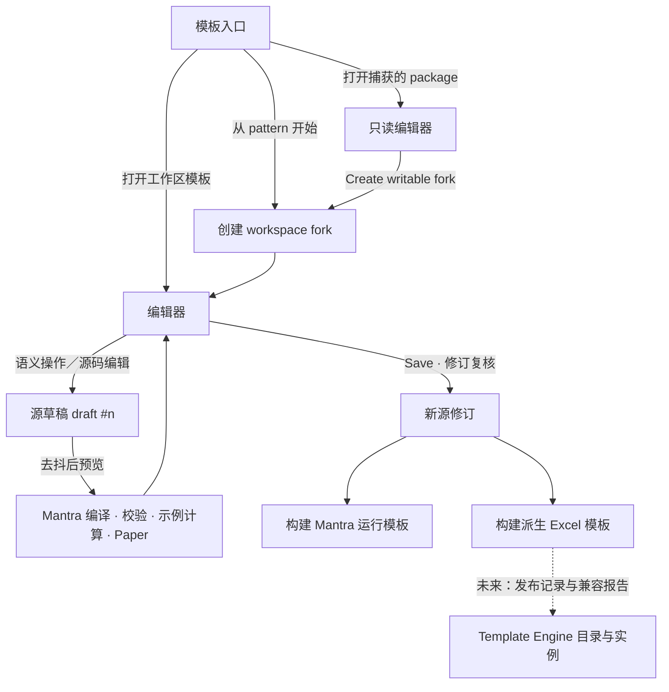
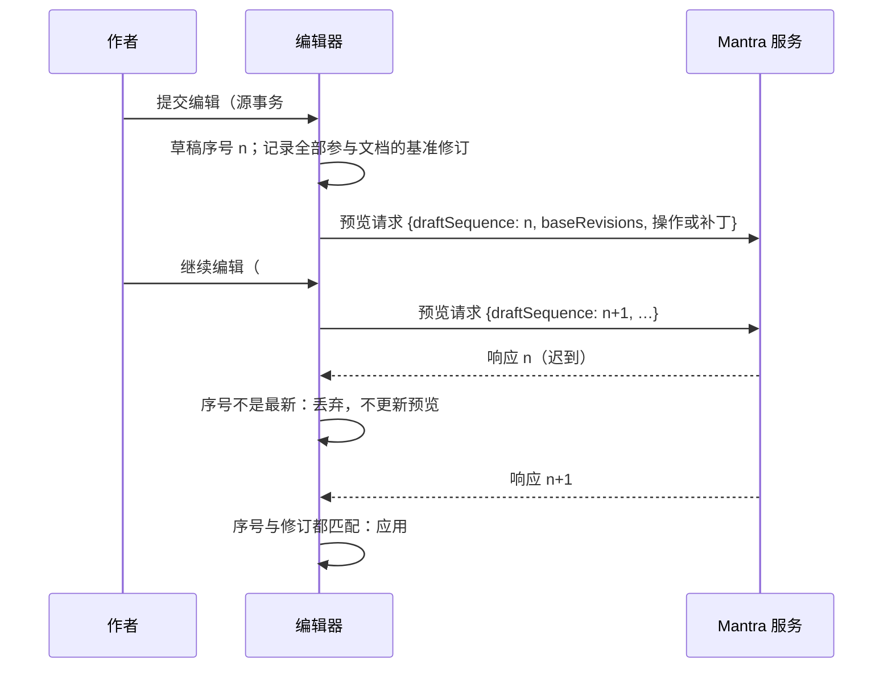

# 可视化 DSL 编辑器：设计规范与页面流程

> 状态：**设计规范（PLANNED）**。本文规定 Mantra 独立可视化 DSL 编辑器首个切片的界面、交互与反馈，
> 不声明模板编辑器、owner 句柄、模板源补丁、模板 draft Paper、构建记录或发布能力已经实现。
> 相关文档：[进度与基线](README.md) · [状态与权限矩阵](state-matrix.md) ·
> [复用、token、接口缺口与实施计划](implementation-plan.md) · [工作台契约](../contract.md) ·
> [界面规格](../ui-spec.md) · [可视化模板编辑提案](../visual-template-authoring.md) ·
> [DSL 作者路径与两个交付目标](../../template-directions.md) · [可复用模式](../../reusable-patterns.md)
> 评审基线：Mantra `682bd2c`（任务分支）；Template Engine `6443c688`。

## 0. 阅读约定

全文用三种标记区分能力来源，评审时不得把后两种读成现有产品能力：

| 标记 | 含义 |
| --- | --- |
| 【已实现】 | 当前代码已提供，文中给出入口 |
| 【设计】 | 本文规定，尚未实现；需要的契约见 [实施计划 §4](implementation-plan.md#4-接口缺口) |
| 【原型】 | fixture 原型用录制的真实引擎响应或前端模拟实现，只用于评审 |

| 术语 | 含义 |
| --- | --- |
| 模板定义 | schema、layout 与它们 include 的 fragment；可复用，是作者编辑的对象 |
| 示例输入 | 绑定案例中的 `(inputs …)`、`(params …)` 与 `(sources …)`；只用于预览，不属于模板定义 |
| owner 句柄 | 服务端签发的不透明写目标：精确源文档、声明、可编辑属性与修订。显示坐标和格式化文本只用于导航 |
| 源事务 | 一次语义操作或一段源码编辑形成的最小补丁集，附逆补丁；撤销恢复精确字节 |
| 草稿序号 | 每次草稿变化单调递增的整数；预览响应只在序号和全部参与修订都匹配时应用 |
| 上一有效预览 | 当前草稿无效、正在计算或无法预览时，继续显示但明确标为过期的最近一次有效预览 |
| 录制状态 | 原型中由生成脚本对源副本施加脚本化修改后，从真实 `mantra serve` 录制的响应 |

## 1. 目标、范围与边界

### 1.1 目标

作者在工作表式网格中修改模板定义；屏幕上看到的是同一份 DSL 经 Mantra 编译、用示例输入计算后得到的
Paper。每个可见改动都落到 DSL 源码中的最小改动，源码视图随时可读、可直接编辑。

首个切片要让普通作者在不手动查找 DSL 文件的情况下完成三件事：

1. 从现有 pattern 创建可写副本，改名有意义的字段并改一个公式；
2. 看到即时反馈：新值、技术错误、业务 finding、源码差异，以及仍在显示的上一有效预览；
3. 保存为新的源修订，并分别查看两个交付目标的构建状态，不被误导为已经发布或与下游同步。

### 1.2 首版切片（S1）

目标面板是 `docs/patterns/capped-allocation` 的 `controls`（Allocation conservation）。它是一个没有成员维度的
scalar panel：layout 以 `(table controls {:style :tiered} :operator :label :main :status)` 声明，当前引擎输出的
Paper 为 Description、Amount 与 status 三列；6 个计算项都带 `:class`；有 note；
版式选用 `:style-preset [:utilities :working-paper]`；`unallocated` 在示例输入下为零，引擎把该行标为
`explains-zero` 并继续显示。

| 可编辑属性 | 源中的 owner（以本面板为例） | 设计中的语义操作 |
| --- | --- | --- |
| 面板标题 | 版式表声明 `:title`；没有时为 schema `(section controls "Allocation conservation" …)` 的标题。界面必须显示实际供值的声明 | `setText` |
| 行标签 | `(info unallocated "Request not allocated" …)` 的标签字符串 | `setText` |
| 注释 | `(note "Unallocated request is …" {:class :note})` 的文本 | `setText` |
| 公式 | `line`／`info` 的表达式，例如 `(- request allocated-total)` | `setFormula` |
| class 分配 | item 选项 `:class`，单个关键字或向量 | `setClasses` |
| 有限布局 | layout 文档选项 `:title`、`:precision`、`:hide-zero` | `setLayoutOption` |

`reconcile` 的左右表达式、`check` 条件、表的 `:style` 与列声明在 S1 中只读显示，可在源码视图编辑。
起点是四个现有 pattern；它们的期望值已在 [patterns/README](../../patterns/README.md) 独立复算。

### 1.3 后续切片与非目标

- 后续切片：插删行列、重排、动态维度、转置表、`style-class` 定义的增删、共享 pattern 组合、
  多用户协作、模板发布服务、Template Engine 运行时适配。
- 非目标：不引入 UI DSL；不用 Excel A1 公式解释源码；不运行 Template Engine 应用、后端或
  OfficeSession；前端不计算、不汇总金融值；屏幕所见不承诺导出分页、字体或像素一致。

### 1.4 已定约束

- 可视化网格和源码视图编辑同一份原始 DSL；作者、编译、预览与构建流程共享，之后才分叉为 Mantra 原生运行
  与派生 Excel 两种交付（[template-directions](../../template-directions.md)）。
- Template Engine 只在下游接收派生 Excel；其已有纯 Excel 公式模板独立，不要求逆向转换。下游实例有自己的输入
  和历史；直接修改生成公式是派生分叉，不能回写 DSL，也不能被下一次生成静默覆盖。
- 所有值、Explain 与业务 finding 来自 Mantra；Decimal 以精确字符串传输，舍入显式（契约 W2、W4）。
- 捕获的 package 定义只读；开发需要显式创建授权可写的 workspace fork，保留 include、映射与依赖身份。

## 2. 对象、通道与身份

### 2.1 作者面对的对象

| 对象 | 持久化事实 | 写入者 | 历史 | 界面标记 |
| --- | --- | --- | --- | --- |
| 模板定义 | 工作区中的 schema／layout／fragment 文本 | 作者：语义操作或源码编辑【设计】 | 本编辑器的源历史【设计】 | `Template definition` |
| 示例输入 | 案例文本 | 现有案例操作 `setInput` 等【已实现】 | 案例服务端历史，50 个版本【已实现】 | `Example input` |
| 参数集 | parameters 文本 | S1 只读 | — | `Parameter` |
| 预览 | 不持久化 | Mantra 引擎 | — | `Preview · draft #n` |
| 构建记录 | 每个目标一份记录【设计】 | 构建服务【设计】 | 构建列表 | `Build · <target>` |
| 下游实例 | Template Engine 的 Office 模型 | Template Engine 用户 | Template Engine 历史 | 不在本编辑器中编辑 |

### 2.2 编辑通道必须显式可见

定义、示例输入和参数不能靠颜色区分，也不能从颜色推断可编辑性。可编辑性只来自服务端返回的 `editable`
与 owner 句柄是否可取得。

- Inspector 标题区显示通道徽标：图标加文字，例如 `ƒ Template definition`、`✎ Example input`、
  `🔒 Read-only · captured package`。
- 网格单元格用形状区分：示例输入沿用现有输入框外观（蓝底蓝字加 1px 边框）；模板定义在悬停和选中时显示
  虚线下划线和角标 `ƒ`；只读单元格显示锁形角标；颜色只是冗余提示。
- 状态栏和撤销按钮的提示总是写出作用对象，例如 `Undo: label of unallocated (template)` 与
  `Undo: requested-units (example case)`。

### 2.3 身份栏

身份栏始终显示当前编辑对象、源版本与运行时，避免把作者预览、构建产物和下游实例混为一谈：

```text
Template  pattern/capped-allocation · v1.0.0 · source 3f6c0e1a… · draft #12   [Unsaved changes]
Runtime   Mantra author preview · example inputs: capped-allocation/case-demo.mantra
```

- `source` 是最近一次已保存的参与文档修订（64 位修订取前 8 位显示，悬停显示全文和参与文档列表）。
- `draft #n` 只在有未保存改动时出现；它不是修订号。
- 运行时永远写 `Mantra author preview`。派生 Excel 的状态只出现在构建面板，Template Engine 只出现在
  交付跳转中。
- 原型在身份栏前加不可关闭的标签 `Prototype · recorded engine data`。

## 3. 页面流程

### 3.1 总流程



### 3.2 模板入口 `/authoring`

【设计】入口页分三组，每组都是可用键盘浏览的列表：

| 分组 | 内容 | 主要动作 |
| --- | --- | --- |
| Workspace templates | 工作区中可写的 schema＋layout 组合：标题、schema id／version、源修订、未解决诊断数、最近修改 | Open |
| Start from a pattern | 四个现有 pattern：用途、保留的行、独立期望值摘要、使用的样式词汇 | Create editable copy… |
| Captured packages | 只读 package 中的模板：package id／version、资源摘要 | Open read-only · Create writable fork… |

创建副本与 fork 使用同一个对话框，列出：

- 依赖闭包：schema、include 的 fragment、layout、参数集、示例案例、数据文件及各自的 SHA-256；
- 目标可写目录，以及哪些资源仍然只读；
- 保留的身份：package id／version、include 路径、映射与依赖版本；
- 说明：`The original stays unchanged. The copy is a new workspace template.`

空工作区显示原因和两个动作：`Start from a pattern` 与 `Open a DSL file`。工作区扫描失败沿用现有
`workspaceError` 事件，显示错误码与重试。

### 3.3 编辑器主界面

桌面布局（≥ 1280 px）：

```text
┌ Identity bar：模板 · 源修订 · draft # · 保存状态 · Undo/Redo · View: Grid|Source|Split · Build ▾ ┐
├ Outline 240 ┬ Formula bar（Mantra DSL）                               ┬ Inspector 360    ┤
│ 面板与声明   │ Grid：所选面板的 Paper                                  │ Property         │
│ 含隐藏、零值 │   或 Source：参与文档                                    │ Style            │
│ 与不活跃项   │   或 Split：左 Grid、右 Source                           │ Explain          │
│              │                                                        │ Example input    │
├──────────────┴ Drawer：Problems · Source changes · Build ────────────┴──────────────────┤
└ Status bar：预览状态 · draft # · 参与修订 · 引擎指纹                                        ┘
```

- 每个区域独立滚动；页面本身不横向滚动。网格在卡片内部横向滚动。
- Outline 列出面板中全部声明，包括 `:hidden`、零值隐藏和 `:when` 不活跃项，各自附原因徽标。
- Inspector 默认停靠右侧，宽度 320–520 px 可拖动；拖动不进入撤销历史。
- Drawer 默认收起，有新的技术错误时显示计数但不自动抢焦点。

### 3.4 双视图

【设计】三种视图共享同一选择与同一源历史：

- **Grid**：所选面板的 Paper，行、列、格式和样式全部来自引擎（契约 W3）。
- **Source**：参与文档的源码，按 schema、layout、fragment、case 分标签；只读文档标锁。
- **Split**：≥ 1280 px 时左右并排；更窄时退化为 Grid／Source 标签切换并保留选择。

选择同步规则：

1. 在网格选中单元格时，源码视图高亮其主 owner 范围（如标签字符串），并以较淡底色标出次要 owner
   （如 `:class` 值）。
2. 在源码中移动光标时，若所在声明投影在当前 Paper，网格选中对应单元格；重复维度投影全部描边，
   活动单元格保持不变。
3. 声明未投影（隐藏、零值隐藏、不活跃或属于其他面板）时，Outline 选中该声明，网格顶部显示
   `Not shown in this Paper: hidden by :hide-zero` 一类说明和可用的显示开关。
4. 源码编辑按空闲 500 ms 或失焦合并为一个源事务，进入与网格相同的预览管线。语法错误使草稿无效，
   网格继续显示上一有效预览并在顶部显示过期横幅。

### 3.5 网格

【设计】网格是 Mantra 自己的 HTML 表格，沿用现有 `PaperTable` 的单元格外观与查找能力，不引入 Canvas：

- 行与单元格来自 Paper；`address` 只用于 Explain 与导航，写目标来自 owner 句柄。
- 标签、注释、标题等文字单元格也可选中，因为它们是模板定义的 owner。现有 `PaperTable` 只能选中带地址的
  数值单元格（差异见 §4.8）。
- 单元格角标：`ƒ` 模板定义、锁形只读、`!` 技术错误、`✗`／`✓` 引擎校验状态（沿用 Paper status 列）、
  `⌀` 有原因的零、`⇄` 共享声明。角标都有可读文本，不只靠颜色。
- `Show formulas`（Ctrl/Cmd+`）在数值列显示 DSL 公式原文，不显示 A1。
- 沿用现有 `Show zero rows`（`includeZero`）与 `Find in table`，两者都不改变行序与数值。

### 3.6 Property 面板

【设计】标题区是 owner 面包屑与通道徽标：

```text
ƒ Template definition
capped-allocation/schema.mantra › (info unallocated …) › label        handle: current
```

- 共享声明：owner 位于被多个 schema include 的 fragment 时，显示
  `Shared declaration: used by 4 schemas in this workspace` 及清单；第一次编辑前要求确认作用范围，
  每个草稿每个 owner 确认一次。S1 中 fragment 里的 `defn` 只读，可跳转。
- 重复维度行：成员单元格共享同一声明，显示 `1 declaration · 3 member projections`；修改作用于声明，
  不能逐成员修改。由维度表 `:title` 列生成的成员标签属于示例输入通道，编辑它就是编辑案例数据。
- 只读原因必须具体：`Captured package resource`、`Owner unavailable: the declaration moved`、
  `Generated by the engine`、`Not editable in this version (reconcile operand)`。
- layout 选项写明作用范围：`Applies to the whole Paper (layout pattern/capped-paper)`。

### 3.7 公式栏

【设计】公式栏只编辑 Mantra DSL，不复用 Excel 的函数对话框或 A1 名称框：

- 左侧语义名称框显示节点 id 与种类，例如 `unallocated · info`；输入节点 id 跳转到其 owner。
- 编辑区为多行 CodeMirror：补全来源是当前作用域的节点（标签、类型、当前值）、fragment 中的 `defn`、
  `mantra.calc@2` 与 Normein 标准函数；悬停显示签名与当前值；诊断用波浪线标出精确范围并显示诊断码。
- 公式获得焦点时，被引用且投影在当前 Paper 的节点在网格中描边；面板外的引用在公式栏下方列出，可跳转。
- 现有案例公式槽位的补全、悬停、检查与 `preview-paper` 预演【已实现】（契约 §7.1、§8.2）；
  schema 声明公式的语言服务和预演需要新契约【设计】。

### 3.8 Style 面板与 class

【设计】class 编辑只分配已有词汇，不定义新的 CSS：

- item 的 class 以芯片显示，顺序保留源中写法，但界面注明 `Order does not set precedence`。
- `Add class` 列出：所选 `:style-preset` 中的 class（按预设分组并显示声明），本 layout 中的
  `style-class` 定义（显示源位置），以及没有匹配规则的已用标签（`No matching rule · no visual effect`）。
- 生效样式区显示所选单元格最终的 weight／tone／fill（来自 Paper cell `style`），并按 layout 声明顺序
  列出贡献规则。示例为 `actuals-vs-baseline` 版式中 `remaining` 行（`:class [:result :key-result]`）的
  Total 列单元格；引擎输出的最终样式是 bold · accent · subtle fill：

  | 顺序 | 来源 | 贡献 |
  | --- | --- | --- |
  | 1 | `:style-preset :working-paper` → `.result` | bold · accent · accent fill |
  | 2 | layout.mantra:5 `(style-class :key-result …)` | bold · accent · subtle fill |
  | 3 | layout.mantra:6 `(style {:class :result :column :cross-total} {:use [:strong :accent] :fill :subtle})` | `:use` 从左到右合并 `.strong`、`.accent`，再应用显式 `:fill :subtle` |

- 规则来源列表需要服务端返回样式来源（缺口 G-A9）；没有时只显示最终样式和 `Rule provenance unavailable`，
  不在前端重算选择器。
- 面板底部固定说明：`Styles never change values, rounding, aggregation, applicability or validation.`
  `control` class 不代表校验通过。

### 3.9 Explain 与示例输入

- Explain 标签沿用现有 `ExplainDetails`、`ValidationEvidence` 与聚合证据：公式、步骤、引用、结果、舍入与
  校验结果【已实现，针对已保存案例】。模板草稿的 Explain 需要草稿预览返回的 trace【设计】。
- Example input 标签编辑示例案例的输入，使用现有案例操作与独立的 `POST …/preview-paper`，后者返回同一次候选计算的
  Run、差异与 Paper，并携带基准修订与草稿序号【已实现，仅文件工作区】。标签页顶部固定说明
  `Changes example inputs in capped-allocation/case-demo.mantra — not the template`。
- 示例输入的撤销属于案例历史，和模板源历史分开（§4.6）。

### 3.10 源码差异

【设计】Drawer 的 `Source changes` 按文档显示草稿相对基准修订的统一差异：

- 每个 hunk 标注产生它的语义操作，例如 `Label · unallocated` 或 `Source edit · layout.mantra`。
- 文件头写明 `Unrelated bytes unchanged`；注释、空白和无关条目逐字节保留由服务端补丁保证，前端只显示。
- `Revert this change` 生成一个应用逆补丁的新源事务；逆补丁已因后续编辑无法应用时禁用并说明原因。

### 3.11 保存、校验与构建反馈

- Save（Ctrl/Cmd+S）提交草稿：服务端重新核对精确源文档和全部参与 graph 的修订，拒绝过期句柄，
  并对技术错误（语法、类型、引用、循环）拒绝提交【设计】。业务 finding 不阻止保存。
- 多文档提交的原子性策略见[实施计划 §6](implementation-plan.md#6-待决策项)；未定之前，UI 不宣称多文档事务。
- Build 菜单对已保存的有效修订分别构建两个目标，结果在 Drawer 的 `Build` 标签：

| 目标 | 步骤 | 报告 | 现状 |
| --- | --- | --- | --- |
| Mantra runtime template | 编译 → 示例案例计算 → 运行模板记录 | 源修订、引擎指纹、案例与版式身份、诊断 | 【设计】 |
| Derived Excel template | 编译 → 示例案例计算 → `ExcelExport` | 公式单元格、输入单元格、命名区域、fallback、求值错误；目标兼容性 | 导出路径与报告【已实现，针对已保存案例】；构建记录【设计】 |

- 构建失败保留失败状态和部分证据，不显示成功；源修订变化后旧构建标为 `Outdated`。
- 兼容性一栏固定写出未验证事项：`Template Engine import and recalculation: not verified`、
  `Excel equivalence: not verified`。
- Publish 在 S1 中禁用，原因 `Publishing is planned; no publisher or catalog contract exists yet`。
  原型中的导出与发布按钮永不返回成功。

### 3.12 首次使用

1. 从 `Start from a pattern` 选择 pattern，确认 `Create editable copy`。
2. 打开编辑器后显示三个非模态提示，可用 Escape 关闭，可从 Help 重新打开：
   `Rename a label` → `Change a formula` → `Check the preview and findings`。
3. 网格上方固定说明：`Values are calculated by Mantra from example inputs. Example inputs are not part of the template.`
4. 第一次保存前，Save 提示说明会写入哪些文档。

### 3.13 窄屏

| 宽度 | 行为 |
| --- | --- |
| ≥ 1280 | 三栏，Split 可用 |
| 1024–1279 | Inspector 改为右侧覆盖抽屉；Split 退化为标签切换 |
| 768–1023 | Outline 收进抽屉；Inspector 为底部面板（默认 50% 高，可调） |
| < 768 | 单列：身份栏缩为模板名与状态；Grid／Source 分段切换；编辑在全屏 Inspector 中完成，返回后焦点回到原单元格；触控目标 ≥ 44 px；左右 16 px 留白；页面不横向滚动 |

## 4. 键盘、输入与焦点

### 4.1 焦点区域

焦点区域依次为身份栏、Outline、公式栏、网格／源码、Inspector、Drawer；F6／Shift+F6 在区域间循环。
每个区域都有可见焦点环；页面提供 `Skip to grid` 跳转链接。网格只占一个 Tab 停靠点（roving tabindex）。

### 4.2 浏览态（网格获得焦点，未在编辑）

以 [界面规格 §6](../ui-spec.md#6-通用交互与状态) 为默认：

| 按键 | 行为 |
| --- | --- |
| 方向键 | 移动活动单元格；可移动到文字单元格与数值单元格 |
| Shift+方向键 | 扩展矩形选区（用于复制和多行 class 分配） |
| Home／End，Ctrl/Cmd+Home／End | 行首／行尾；表首／表尾 |
| Enter、F2 | 编辑活动单元格的主属性：标签与标题为单行编辑；注释与公式为多行编辑；不可编辑时朗读具体原因 |
| 可打印字符 | 单行属性：以该字符替换内容开始编辑；公式：打开公式编辑器并选中原公式，键入内容替换它 |
| Tab／Shift+Tab | 离开网格，进入下一个／上一个焦点区域 |
| Escape | 有选区时收缩为活动单元格；否则不动作 |
| Delete／Backspace | 不清空定义；提示 `Labels and formulas cannot be cleared here. Press Enter to edit.` |
| Ctrl/Cmd+C | 复制选区（§4.5） |
| Ctrl/Cmd+V | 粘贴到活动单元格的属性（§4.5） |
| Ctrl/Cmd+Z；Ctrl/Cmd+Shift+Z、Ctrl+Y | 撤销／重做源事务（§4.6） |
| Ctrl/Cmd+S | 保存 |
| Ctrl/Cmd+` | 切换 Show formulas |
| F8／Shift+F8 | 下一个／上一个技术错误 |
| Shift+F10、ContextMenu | 单元格菜单：Edit、Show in source、Explain、Copy semantic address |

### 4.3 编辑态

| 按键 | 单行（标签、标题） | 多行（公式、注释） |
| --- | --- | --- |
| Enter | 提交；成功后下移一格；失败保留草稿与焦点 | 换行 |
| Shift+Enter | 提交；成功后上移一格 | 换行 |
| Ctrl/Cmd+Enter | 提交；成功后焦点留在原单元格 | 提交；成功后焦点回到原单元格；失败保留草稿与焦点 |
| Tab／Shift+Tab | 提交；成功后右移／左移到下一个可编辑单元格 | 提交；成功后焦点回到原单元格 |
| Escape | 放弃本次未提交输入，恢复进入编辑前的文本，焦点回到单元格 | 同左 |
| 补全菜单打开时 | Enter／Tab 先接受候选，方向键在候选间移动，Escape 只关闭菜单 | 同左 |
| IME 组合期间 | 不提交、不导航、不发预览请求；Enter 只确认候选 | 同左 |

“提交”指把输入作为一个源事务放入草稿，不是保存到文件。成功与失败的判定：

- **成功**：操作被接受，且该 owner 上没有技术错误；业务 finding 不算失败。
- **失败**：操作被拒绝（只读、句柄过期、单行文本含换行、空标签），或检查报告该 owner 有技术错误。
  被拒绝的操作不进入草稿；有技术错误的操作进入草稿使其成为无效草稿，编辑器保持打开并显示诊断，
  用户可以就地修复后再次提交，或 Escape 关闭编辑器（草稿保留，可撤销）。
- 公式提交等待检查结果再决定是否移动；单行文字的格式错误在本地即时报告。

【设计】浏览态焦点位于跟随活动单元格的输入代理上，网格通过 `aria-activedescendant` 指向活动单元格，
这样第一次 IME 组合就落在可编辑元素里，不丢字。【原型】在 keydown 时把焦点移入单元格内的编辑框，
并用测试固定“组合期间不提交、不导航”；完整 IME 矩阵需要浏览器验证。

### 4.4 Escape 分层

从内到外逐层关闭：补全菜单 → 放弃当前未提交输入 → 收缩选区 → 关闭覆盖层或抽屉，焦点回到来源。
Escape 从不撤销已提交的源事务。

### 4.5 复制、剪切与粘贴

- 复制：`text/plain` 为选区显示文本的 TSV（与屏幕一致的引擎 `display`），`text/html` 为同内容的表格；
  另附语义地址（节点 id 与属性种类），不附 owner 句柄，因为句柄与会话和修订绑定。
- 剪切：定义不可剪切；Ctrl/Cmd+X 只复制，并提示 `Cut is not available for template definitions`。
- 粘贴到单个文字单元格：等同于以粘贴文本提交编辑，按 §4.3 判定成功或失败；多行文本粘贴到单行属性时拒绝。
- 粘贴到公式单元格：打开公式编辑器并填入原文，等待用户提交；不做 A1 翻译。以 `=` 开头的 Excel 公式会被
  DSL 检查报告错误。
- S1 不支持多单元格粘贴到定义，提示 `Paste into one property at a time in this version`。
- 示例输入的粘贴走现有服务端原文解析（契约 W4），前端不解析数字。

### 4.6 撤销与重做

- 网格、Inspector、公式栏和源码视图共享一份源历史；每个条目是一个源事务及其逆补丁，撤销恢复精确字节，
  包括无效草稿。
- 合并：源码视图连续输入在同一文档内按空闲 1 秒合并；网格与 Inspector 每次提交一个条目；
  多行 class 分配是一个条目，包含多个 owner 的操作。
- 示例输入使用案例服务端历史【已实现】。Ctrl/Cmd+Z 作用于当前焦点所在通道；Undo 按钮的提示写出作用对象。
- 保存后历史保留；撤销到保存点之前会重新产生未保存草稿。
- 外部修改只涉及未改动的文档时历史保持可用；与某个条目的补丁范围重叠时，该条目禁用并显示
  `Cannot undo: source changed outside this editor`。

### 4.7 焦点返回

- 关闭 Inspector、Drawer、对话框或全屏面板时，焦点回到打开它的控件；若该控件已不存在，回到活动单元格。
- 单元格提交成功后按 §4.3 移动；失败时焦点留在编辑器。
- 保存后焦点回到保存前的位置；冲突对话框关闭后，焦点到第一个受影响的 owner。
- 撤销与重做后，活动单元格移到受影响 owner 的投影位置（或源码范围），并通过 live region 朗读
  `Undid label of unallocated`。

### 4.8 与现有 PaperTable 的差异

新作者网格是独立组件；现有工作台页面的行为不变：

| 方面 | 现有 `PaperTable`（`682bd2c`） | 作者网格 |
| --- | --- | --- |
| Tab | 每个带地址的单元格都是按钮和 Tab 停靠点，Tab 逐格移动 | 网格一个停靠点，Tab 离开网格（符合 ui-spec §6） |
| 可选中单元格 | 只有带 `address` 的数值单元格 | 全部渲染单元格，文字单元格可编辑其 owner |
| Enter | 触发按钮点击，即选中 | 进入编辑 |
| Escape | 无动作 | 分层取消（§4.4） |
| 范围选择、Home／End | 无 | 有 |
| 编辑 | Paper 只读；输入在录入页编辑 | 模板定义在网格编辑；示例输入在 Inspector 编辑 |

### 4.9 后续可选：Excel 导航

Template Engine 采用 Excel 语义：浏览态 Enter 下移、Tab 右移、直接输入开始编辑（`resolveSheetKeyboardShortcut`）。
S1 不采用。若评审希望两个产品键位完全一致，可作为作者偏好 `Spreadsheet keys` 提供，只作用于作者网格，
需要另行评审。

## 5. 预览、诊断与反馈

### 5.1 草稿预览管线



- 去抖：源码输入空闲 400 ms；离散的属性提交立即发送。被取代的请求可以取消，但取消只是优化。
- 应用条件：响应的草稿序号是最新发出的序号，且响应声明的全部参与修订与当前基准相同；否则丢弃。
- 现状：已有案例操作可用 `preview-paper` 得到满足这些条件的真实候选 Paper【已实现】；
  模板定义的草稿预览没有接口（缺口 G-A4），原型用录制状态模拟【原型】。

预览指示与文案：

| 状态 | 文案 |
| --- | --- |
| 当前 | `Preview: current · draft #12` |
| 计算中 | `Calculating draft #13…`，网格保持上一结果并标为过期 |
| 无效草稿 | `Previous valid preview (draft #11) — draft #13 has 2 errors` |
| 运行时失败 | `Draft #13 calculated with a runtime failure`，失败节点保留失败身份，不显示为有效值 |
| 无法预览 | `No engine preview for this draft`，网格保持上一有效预览并标为过期 |

### 5.2 诊断位置一致

同一个技术错误同时出现在：网格单元格角标（若投影）、公式栏波浪线、源码范围、Outline 徽标和 Drawer 列表。
全部由同一诊断的 owner 与源范围驱动；坐标或文本匹配不能决定位置。

- 同一 owner 的多条诊断聚合显示，最内层范围在前；不推断因果。例如未知符号与随之而来的调用参数错误
  显示在同一组。
- Drawer 中每条诊断显示诊断码、本地化说明和原始消息；有源上下文时沿用现有 `DiagnosticSourceContext` 摘录。
- 被零值抑制或不活跃的 owner 仍可从 Drawer 和 Outline 定位到源码。

### 5.3 四类结果不得混淆

| 类别 | 来源 | 表现 | 是否阻止保存 |
| --- | --- | --- | --- |
| 技术错误 | 语法、类型、引用、循环 | `!` 角标、Problems 计数、无效草稿 | 阻止 |
| 运行时失败 | `MANTRA-EVALUATION` 等 | 失败节点保留失败身份；构建为失败 | 不阻止源保存；不能显示成功构建 |
| 业务 finding | check／reconcile 失败 | Paper status 列 `✗`、Findings 列表，值继续显示 | 不阻止 |
| 人工核准 | 不属于 Mantra 作者流程 | S1 没有人工核准状态 | — |

Template Engine 的 `ApplicationStatusPill` 六种状态（待输入、待确认、已核准等）表达人工确认，不能用来显示
Mantra 引擎 finding。

### 5.4 隐藏、零值与不活跃定义

Outline 列出全部声明并附原因：`Hidden (:hidden)`、`Zero row hidden by :hide-zero`、
`Inactive for example inputs (:when)`。选中后 Inspector 照常显示 owner；零值隐藏项可一键打开
`Show zero rows`，其他原因只给出跳转到源码的入口。

## 6. 与 Template Engine 并行使用

### 6.1 原则

两个产品、两个运行时、单向交付。界面不能出现任何暗示自动同步的措辞或动画。

### 6.2 一致的外框

| 元素 | Mantra 编辑器 | Template Engine 派生实例 |
| --- | --- | --- |
| 身份 | `Template · id · version · source <rev> · draft #n` | `Workbook · Derived from Mantra <id> v<version> · source <rev> · build <id>` |
| 运行时 | `Mantra author preview` | `Template Engine (Office)` |
| 来源标识 | `DSL source (editable)` | `Generated from Mantra — not synchronized`；分叉后 `Forked from generated template` |
| 左侧 | Outline | 现有变量／来源／历史栏 |
| 右侧 | Inspector，默认 360 px | 现有应用面板，默认 367 px |
| 状态胶囊 | 源草稿状态（§2.3） | Office 保存状态与人工确认胶囊；词汇各自独立 |

### 6.3 快捷键对照

| 按键 | Mantra 作者网格 | Template Engine 工作表 |
| --- | --- | --- |
| 方向键、Shift+方向键 | 移动、扩展选区 | 同 |
| F2 | 编辑 | 编辑 |
| Enter（浏览态） | 编辑 | 下移 |
| Tab（浏览态） | 离开网格 | 右移 |
| Escape | 分层取消 | 取消编辑 |
| Ctrl/Cmd+Z、Ctrl+Y | 源历史或案例历史 | Office 历史 |
| Ctrl/Cmd+C／V | 显示文本与语义地址；单属性粘贴 | 单元格值、公式与格式 |
| Ctrl/Cmd+` | 显示 DSL 公式 | 显示 Excel 公式 |
| Ctrl/Cmd+D、Ctrl/Cmd+R | 不绑定，交给浏览器 | 向下／向右填充 |
| Delete | 提示不可清空定义 | 清除内容 |

差异只在 Enter、Tab 和填充；两者都在帮助与首次提示中说明。

### 6.4 交付跳转

- Mantra → Template Engine：S1 只提供派生 XLSX 下载（现有导出路径），并写明
  `Template Engine import is not verified`。将来只能从带兼容报告的 Excel 构建记录发起，
  在 Template Engine 目录登记固定版本的产物后，再提供 `Open in Template Engine…`【设计】。
- Template Engine → Mantra：派生实例的身份栏提供 `View source template`，深链携带模板 id、源修订与构建 id；
  Mantra 以只读方式打开该修订，并显示 `This is the source revision that generated the workbook.
  The current source is <rev> (N saves later).`【设计】。
- 两边都不提供“同步”按钮。重新生成只产生新构建，已有实例保留其版本，迁移需要显式操作。

### 6.5 下游实例与分叉

Template Engine 侧的实例身份、分叉检测与兼容报告见 Template Engine
`.agentdocs/frontend/mantra-derived-template-parallel-use.md`。Mantra 侧只承诺：构建记录保存源修订、
产物摘要与映射边车；派生实例的修改不会回写 DSL。

## 7. 可访问性与本地化

- 网格使用 `role="grid"`、`row`、`gridcell`；只读单元格 `aria-readonly="true"`；选区用 `aria-selected`；
  通道与 owner 通过 `aria-describedby` 朗读。
- 预览与保存状态用 polite live region；保存失败与冲突用 alert。
- 浅色与深色主题都满足 WCAG 2.2 AA；错误、finding、只读与通道均有图标和文字。
- 界面文字进入 de／en 资源包（契约 D2）；业务文字来自文档；数字显示文本来自服务端。原型暂只提供英文。
- 视觉语言沿用工作台的 “Arbeitspapier” token，新增作者 token 见
  [实施计划 §3](implementation-plan.md#3-设计-token)。

## 8. 设计验收清单

- [ ] 任一可见改动都能在 Source changes 中找到对应的最小补丁，且无关字节不变。
- [ ] 网格、公式栏、源码、Outline 与 Drawer 对同一诊断定位到同一 owner 范围。
- [ ] 无效草稿、计算中与无法预览时，旧预览都明确标为过期。
- [ ] 业务 finding 保留数值且不阻止保存；技术错误阻止保存；运行时失败不显示成功构建。
- [ ] 示例输入、参数与模板定义有文字与图标区分，不依赖颜色。
- [ ] 迟到的预览响应不会覆盖新输入；冲突保留草稿与恢复路径。
- [ ] IME 组合期间不提交、不导航；单行与多行的 Enter 规则符合 §4.3。
- [ ] 窄屏下页面不横向滚动，编辑与焦点返回可完成。
- [ ] 导出、发布与 Template Engine 跳转都不显示虚假成功。
