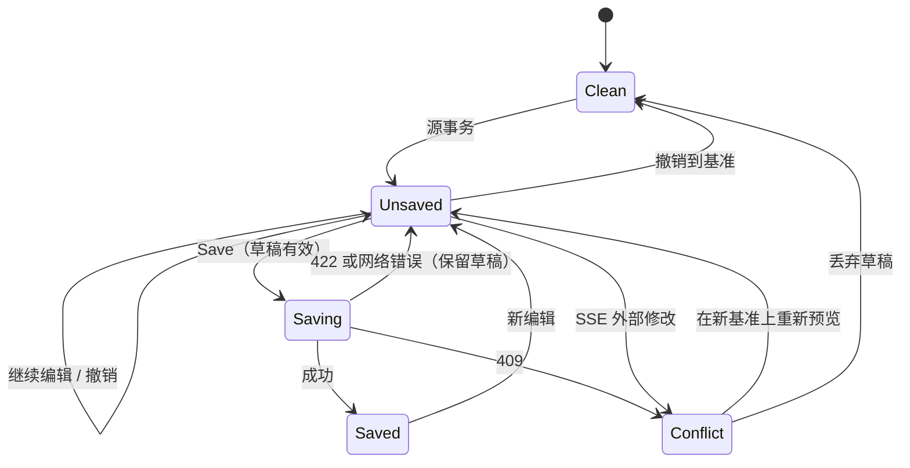

# 可视化 DSL 编辑器：状态与权限矩阵

> 状态：**设计规范（PLANNED）**。本文规定作者编辑器的状态、转换、区域表现与权限，
> 不声明这些状态已有服务端契约。界面与键位见 [设计规范](design-spec.md)，契约缺口见
> [实施计划 §4](implementation-plan.md#4-接口缺口)。标记【已实现】【设计】【原型】的含义同设计规范 §0。

## 1. 状态维度

状态拆成互相独立的维度，避免把“已保存”“有效”“预览新鲜”“业务通过”压成一个枚举：

| 维度 | 取值 | 决定者 |
| --- | --- | --- |
| D1 源草稿 | Clean · Unsaved · Saving · Saved · Conflict | 编辑器与提交响应 |
| D2 草稿有效性 | Unchecked · Valid · Invalid（技术错误） · Runtime failure | 检查／预览响应 |
| D3 预览新鲜度 | None · Calculating #n · Current #n · Previous valid #m · Unavailable | 预览管线 |
| D4 业务校验 | Passed · Findings (k) | 引擎 `validationPassed` 与业务诊断 |
| D5 构建（每个目标） | Not built · Building · Built · Failed · Outdated | 构建记录【设计】 |
| D6 发布 | Not available | S1 固定 |
| D7 本地恢复 | None · Available · Restored (unvalidated) | 浏览器本地存储 |
| D8 连接 | Online · Offline · Reconnecting | 传输层与 SSE |
| D9 访问 | Writable · Read-only (reason) | owner 句柄与权限 |

身份栏的保存状态胶囊按以下优先级只显示一项：

`Read-only` > `Conflict` > `Saving…` > `Restored · not validated` > `Invalid draft` > `Unsaved changes` > `Saved` > （Clean 时不显示）

预览指示（D3）、业务 finding 计数（D4）、构建状态（D5）与连接标记（D8）各有独立位置，不进入胶囊。

## 2. 生命周期状态

| 状态 | 进入条件 | 界面表现 | 允许 | 禁止 | 退出 | 现状 |
| --- | --- | --- | --- | --- | --- | --- |
| 本地恢复草稿 | 打开模板时发现同一模板、同一基准修订集的浏览器草稿 | 横幅 `A draft from <time> was found in this browser. It has not been validated or saved.`，按钮 Restore／Discard | 查看差异、恢复、丢弃 | 保存前必须先通过检查；不得显示为已保存或可发布 | 恢复后进入“未保存”且 D7=Restored；首个与当前草稿匹配、技术有效（valid 或 runtimeFailure）的预览到达后清除标记；丢弃后删除 | 【原型】 |
| 未保存 | 任一源事务进入草稿 | 胶囊 `Unsaved changes`；Source changes 显示差异；离开页面前确认 | 编辑、预览、撤销、保存（需有效） | 构建、发布 | 保存成功、撤销到基准、丢弃 | 【原型】 |
| 保存中 | 提交请求已发出 | 胶囊 `Saving…`；编辑控件只读；保存按钮显示进度 | 查看、复制 | 新编辑、再次保存 | 成功→已保存；409→版本冲突；422→无效草稿；网络错误→未保存加离线标记 | 【原型】模拟 |
| 已保存 | 提交成功，得到新源修订 | 胶囊 `Saved · <rev>` 3 秒后淡出为无；身份栏 source 更新 | 全部 | — | 新编辑→未保存 | 【原型】模拟，写明未写入文件 |
| 预览中 | 已发出最新草稿的预览请求 | 指示 `Calculating draft #n…`；网格保留上一结果并加过期标记 | 继续编辑（产生新序号） | 把未到达的结果当作当前 | 响应匹配→当前；不匹配→丢弃并继续等待最新 | 【原型】 |
| 无效草稿 | 检查报告语法、类型、引用或循环错误 | 胶囊 `Invalid draft`；Problems 计数；owner 处 `!`；Save 禁用并写原因 | 修复、撤销、查看诊断、预览上一有效结果 | 保存、构建 | 修复后检查有效 | 【原型】录制真实 422 诊断 |
| 上一有效预览 | 草稿无效、计算中或无法预览，且曾有有效预览 | 网格顶部 `Previous valid preview (draft #m)` 与过期底纹；数值不更新 | 浏览、Explain（标注属于 #m） | 把旧值当作当前草稿的结果 | 得到当前有效预览 | 【原型】 |
| 版本冲突 | 提交时任一参与修订变化，或 SSE 报告参与文档变化 | 胶囊 `Conflict`；对话框列出变化的文档、外部差异、受影响的 owner；草稿完整保留 | 查看外部差异；在新基准上重新预览并保留草稿；丢弃草稿 | 用旧基准提交 | 重新预览有效后可保存；与外部修改重叠的 owner 需逐个确认 | 【原型】模拟冲突，外部修改后的状态为录制 |
| 只读 | owner 不可取得、捕获 package、无权限或参与文档不可写 | 胶囊 `Read-only · <reason>`；编辑控件禁用并朗读原因 | 浏览、复制、Explain、创建可写 fork（若可） | 任何写操作 | 获得可写副本或权限 | 【原型】部分（共享 fragment 的 `defn`、reconcile 两侧） |
| 构建失败 | 构建任一步骤失败 | Build 标签显示失败步骤、诊断与已产生的部分证据；状态 `Build failed` | 查看报告、修复后重建 | 显示成功或可交付 | 新构建成功 | 【设计】原型不执行构建 |
| 运行时失败 | 源有效但求值失败（如 `MANTRA-EVALUATION`） | 指示 `Calculated with a runtime failure`；失败节点显示失败身份而非数值 | 保存源（不阻止）；查看部分结果 | 显示为有效预览或成功构建 | 修复后预览成功 | 【原型】若录制成功则展示 |
| 业务 finding | check／reconcile 失败 | Paper status `✗`；Findings 计数；值照常显示 | 保存、构建 | 隐藏数值、当作技术错误 | 数据或规则变化后通过 | 【原型】录制 |
| 无法预览 | 服务不可达，或原型中没有录制该草稿 | 指示 `No engine preview for this draft`；保留上一有效预览 | 继续编辑、撤销 | 保存（有效性未知）；任何伪造数值 | 服务恢复或回到已录制草稿 | 【原型】 |

## 3. 关键转换

| 事件 | 前状态 | 后状态 | 规则 |
| --- | --- | --- | --- |
| 提交编辑 #n | 任意可写 | 未保存 · Calculating #n | 序号单调递增；记录全部参与修订 |
| 迟到响应 #k（k < n） | Calculating #n | 不变 | 丢弃；不改变预览、诊断或保存按钮 |
| 响应 #n，修订不同 | Calculating #n | 不变 | 丢弃；若 SSE 已报告外部修改则进入冲突 |
| 响应 #n 有效 | Calculating #n | Current #n · Valid | 应用 Paper、诊断与差异 |
| 响应 #n 技术错误 | Calculating #n | Previous valid #m · Invalid | 诊断定位到 owner；编辑器保持打开（设计规范 §4.3） |
| 修复后重新提交 #n+1 | Invalid | Calculating #n+1 → Valid | 新序号；旧诊断在新响应到达前标为过期，不立即清除 |
| IME 组合进行中 | 编辑中 | 编辑中 | 不提交、不导航、不发请求 |
| 撤销 | 未保存 | 未保存或 Clean | 恢复精确字节；产生新序号并重新预览 |
| SSE 报告参与文档变化 | 任意 | 冲突（有草稿）或刷新（无草稿） | 有未保存草稿时先保留并询问，不自动丢弃 |
| 在新基准上重新预览 | 冲突 | Calculating #n+1 | 未重叠的源事务直接重放；重叠的 owner 标为待确认 |
| 提交返回 409 | 保存中 | 冲突 | 草稿与历史全部保留 |
| 网络中断 | 任意 | 原状态加 Offline | 草稿保存在浏览器；不得显示已保存 |

## 4. 通用状态 × 区域

| 状态 | 入口列表 | 网格 | Inspector | 公式栏 | 源码视图 | Drawer | 身份栏 |
| --- | --- | --- | --- | --- | --- | --- | --- |
| 正常 | 模板与 pattern 列表 | Paper；活动单元格 | 当前 owner 属性 | 当前公式 | 当前文档，同步高亮 | Problems／Changes／Build | 模板、修订、运行时 |
| 等待 | 骨架行 | 保留上一结果并加过期标记 | 属性可读，提交按钮显示进度 | `Checking…` | 可继续编辑 | 计数保持上次值并标为过期 | `Calculating draft #n…` |
| 空 | 说明与 `Start from a pattern` | `No Paper for this panel yet` 与原因 | `Select a cell to see its owner` | 未选中时禁用 | 未打开文档时显示参与文档列表 | `No problems`、`No changes` | 无草稿号 |
| 错误 | 加载失败横幅与诊断码、重试 | 上一有效预览加错误横幅 | 字段下方显示错误，保留原文 | 波浪线与诊断码 | 范围波浪线 | Problems 列表 | `Invalid draft` |
| 冲突 | 列表项标 `Changed outside this editor` | 保留草稿视图，顶部冲突横幅 | 受影响 owner 标 `Changed externally` | 若 owner 受影响则只读，直到确认 | 外部差异与草稿差异分开显示 | Changes 分为 Yours／External | `Conflict` |
| 离线恢复 | 显示本地缓存列表并标 Offline | 上一有效预览加 `Offline` | 可编辑，提示变更只在本浏览器 | 可编辑，不能检查 | 可编辑 | 待发送的草稿 | `Offline · draft kept in this browser` |
| 只读 | `Read-only` 标签与 fork 动作 | 锁形角标，Enter 朗读原因 | 字段禁用并写原因 | 只读显示 | 只读，可复制 | Build 可查看，不可触发 | `Read-only · <reason>` |

## 5. 权限矩阵

| 资源 \ 动作 | 查看与定位 | 改文字属性 | 改公式 | 分配 class | 改有限布局 | 改示例输入 | 保存 | 构建 | 发布 |
| --- | --- | --- | --- | --- | --- | --- | --- | --- | --- |
| 工作区模板（schema／layout） | ✓ | ✓ | ✓ | ✓ | ✓ | — | ✓ 草稿有效 | ✓ 已保存且有效 | ✗ S1 |
| 被多个 schema include 的 fragment | ✓ | 确认作用范围后 ✓ | 确认作用范围后 ✓ | 确认作用范围后 ✓ | — | — | ✓ | ✓ | ✗ |
| fragment 中的 `defn` | ✓ | ✗ S1 只读 | ✗ S1 只读 | — | — | — | — | — | — |
| 捕获的 package 资源 | ✓ | ✗ | ✗ | ✗ | ✗ | ✗ | ✗ | ✗ | ✗ |
| 显式创建的 workspace fork | ✓ | ✓ | ✓ | ✓ | ✓ | 按案例权限 | ✓ | ✓ | ✗ |
| 示例案例输入 | ✓ | — | — | — | — | 按现有案例权限【已实现】 | 案例 CAS 写入【已实现】 | — | — |
| 参数集 | ✓ | ✗ S1 | — | — | — | — | — | — | — |
| 案例参数覆盖 `(params …)` | ✓ | — | — | — | — | 按现有 `setParam`【已实现】 | 案例 CAS | — | — |
| 链接来源的事实 | ✓ 并跳到来源案例 | — | — | — | — | ✗ 在消费者中只读（契约 M3） | — | — | — |
| 引擎生成内容（合计、status、数据生成的成员标签） | ✓ 并跳到 owner | ✗ | ✗ | ✗ | ✗ | 成员标签按案例数据编辑 | — | — | — |
| owner 不可取得（移动、歧义、未授权） | ✓ 显示原因 | ✗ | ✗ | ✗ | ✗ | — | ✗ 涉及它的草稿 | — | — |

“—”表示该动作对此资源没有意义；“✗”表示有意义但禁止，界面必须给出原因。前端禁用只是即时反馈，
最终授权由服务端在操作、预览和提交时重新判定。

## 6. 技术错误、业务 finding 与人工核准

| 类别 | 判定者 | 词汇与图标 | 位置 | 对保存／构建 |
| --- | --- | --- | --- | --- |
| 技术错误 | Mantra 编译与读取（parsing、structural） | `Error` · `!` | Problems、owner、源码范围 | 阻止保存与构建 |
| 运行时失败 | Mantra 求值 | `Runtime failure` · 失败节点不显示数值 | 预览指示、节点 | 不阻止源保存；构建失败 |
| 业务 finding | Mantra check／reconcile（business） | `Finding` · `✗`；通过为 `✓` | Paper status 列、Findings 列表 | 不阻止 |
| 过期证据 | 编辑器 | `Previous valid preview`、`Outdated build` | 预览横幅、构建记录 | 不能当作当前结果 |
| 人工核准 | 人 | S1 不存在 | — | — |

- `:class :control` 只是呈现角色，不代表检查通过。
- Template Engine 的应用确认胶囊（待输入、待确认、已核准、不适用、需复核）属于人工确认词汇，只在 Template Engine
  的派生实例中出现，不用于显示 Mantra finding。
- finding 的颜色可与现有工作台失败结果一致（`--error`），但必须用 `Finding`／`✗` 与技术错误的 `Error`／`!` 区分，
  并分别计数。

## 7. 视觉诊断与源定位一致

1. 每条诊断用同一个 owner 句柄与源范围驱动网格角标、公式栏波浪线、源码范围、Outline 徽标与 Drawer 条目。
2. 坐标、单元格文本或行号不能决定位置；没有 owner 的诊断只显示在 Drawer，并写明 `No owner location`。
3. 被零值抑制、隐藏或不活跃的 owner 仍可从 Drawer 和 Outline 定位到源码。
4. 草稿变化后，旧诊断在新检查到达前标为过期，不立即消失，也不移动到新文本的相同偏移。
5. 引擎在同一 owner 上报告的多条诊断聚合显示，最内层范围在前；界面不推断因果。
6. 原型中的诊断范围来自录制的真实 422 响应（`startOffset`／`endOffset`）；它们证明现有引擎能给出精确范围，
   不代表模板 owner、源补丁或模板 draft Paper 接口已经存在。
